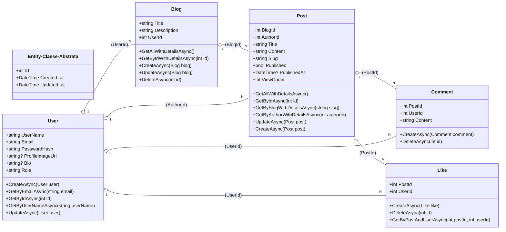

# Fábrica de Software 2025/2

#### Gian Carlo Fiamoncini e Carlos Alberto

## Propostas de projeto

#### Sistema de Blogs, com comentários e moderadores

## Links Of Repos

#### Back-end: https://github.com/gianfiamonciniuniville/UniBlogBackEnd

#### Front-end:

## Tecnologias

- Backend em C# .NET Arquitetura Onion Entity Framework,
- Banco de Dados SQL SERVER via docker,
- Frontend em REACT TS (Framework a decidir)

## Histórias do Usuário

* **Registro**: Como um visitante, eu quero **criar uma conta** para poder participar da plataforma.
* **Login**: Como um usuário, eu quero **acessar minha conta** com e-mail e senha para usar todos os recursos.
* **Atualização de Perfil**: Como um usuário, eu quero **editar minha biografia e foto** para personalizar meu perfil.
* **Visualização de Usuário**: Como um usuário, eu quero **ver o perfil de outro usuário** para conhecer outros membros.

---

* **Criação de Blog**: Como um usuário, eu quero **criar um blog** com um título e descrição para agrupar meus artigos.
* **Gestão de Blog**: Como proprietário, eu quero **atualizar ou deletar meu blog** para mantê-lo organizado.
* **Descoberta de Blogs**: Como um visitante, eu quero **ver a lista de todos os blogs** para encontrar novos conteúdos.

---

* **Criação de Post**: Como um autor, eu quero **escrever e salvar um novo post** no meu blog.
* **Edição de Post**: Como um autor, eu quero **modificar o título, o conteúdo ou o slug** de um post existente.
* **Publicação**: Como um autor, eu quero **publicar ou despublicar um post** para controlar sua visibilidade.
* **Leitura por Slug**: Como um visitante, eu quero **acessar um post diretamente** usando seu link amigável (slug).
* **Listagem de Posts**: Como um visitante, eu quero **ver todos os posts** da plataforma ou **apenas os de um autor específico**.

---

* **Comentário**: Como um usuário logado, eu quero **adicionar um comentário** em um post para interagir com o conteúdo.
* **Remoção de Comentário**: Como um usuário, eu quero **excluir um comentário** que fiz.
* **Curtir Post**: Como um usuário logado, eu quero **curtir um post** para demonstrar que gostei.
* **Remover Curtida**: Como um usuário, eu quero **remover uma curtida** de um post.

## Diagrama de Entidade e Relacionamento

